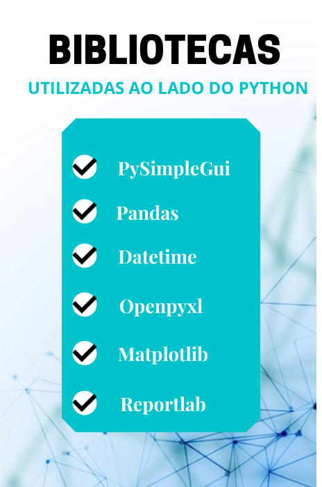

<div align="center">
<h3>👋🏼 Olá! seja bem-vindo 👋🏼 </h3>
<br>

#### Projeto desenvolvido pelos aluno: Daniel Rodrigues de Sousa - Para a disciplina de Programação Orientatada a Objetos - 2024.1

<br>

### Para executar, primeiro deve clonar a pasta para sua máquina
```bash
git clone https://github.com/JeanCarlos899/ConfeitariaPaulistana.git
```
<br>

### Com a pasta clonada, execute na sua IDE o arquivo "setup.py"
<br>

#### O sistema irá instalar as bibliotecas de forma automática(Apenas para windows, outros sistemas a instalação deverá ser feita manualmente), segue abaixo os métodos manuais para serem utilizados caso a instalação não ocorra
<br>

#### Windows
1. PySimpleGui
```bash
pip install PySimpleGUI
```
2. Openpyxl
```bash
pip install openpyxl
```
3. Matplotlib
```bash
pip install matplotlib
```
4. Reportlab
```bash
pip install reportlab
```
5. Datetime
```bash
pip install datetime
```
6. Numpy
```bash
pip install numpy
```
7. Pandas
```bash
pip install pandas
```
<br>

#### Linux
1. PySimpleGui
```bash
sudo pip3 install --upgrade PySimpleGUI 
```
2. Openpyxl
```bash
sudo pip3 install --upgrade openpyxl
```
3. Matplotlib
```bash
sudo pip3 install --upgrade matplotlib
```
4. Reportlab
```bash
sudo pip3 install --upgrade reportlab
```
5. Datetime
```bash
sudo pip3 install --upgrade datetime
```
6. Numpy
```bash
sudo pip3 install --upgrade numpy
```
7. Pandas
```bash
sudo pip3 install --upgrade pandas
```

</div>
<div align="center">
<br>
<br>
<br>
<h2><b>SISTEMA CONFEITARIA PAULISTANA</b></h2>

<br>
<br>


<h3><b>Nossa missão é oferecer um sistema útil e com um preço justo.</b></h3>


<br>
<br>
<br>
<br>

<br>
